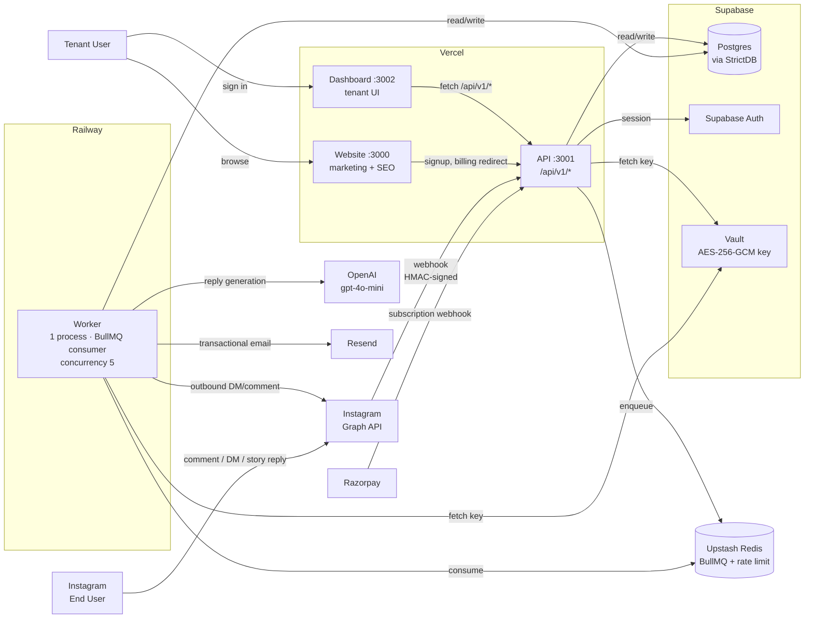

# AutomateBro — Engineering Plan (v1)

> Source of truth for v1 engineering. Read this before any spec or code.
> All cc-mastery rules in `CLAUDE.md` apply on top of this doc.
> When this doc and `CLAUDE.md` conflict, `CLAUDE.md` wins.

**Status:** Draft, awaiting approval
**Last updated:** 2026-04-30
**Budget envelope (v1):** ₹5,000 / month total infrastructure spend
**Target launch:** Private beta — gated on Meta App Review approval

---

## 1. Product summary

AutomateBro is a creator-first Instagram DM automation platform for the Indian
market. v1 ships four capabilities, nothing more:

1. **Connect IG account** via Meta OAuth (Facebook Login for Business).
2. **Comment-to-DM automations** — keyword on a post comment fires a templated
   or AI-generated DM to the commenter.
3. **Story-reply automations** — same shape as comment-to-DM but triggered by
   story replies.
4. **Lead capture inside DM** — DM flow asks for email/phone, parses it from
   the reply, stores it on the `leads` collection, exposes CSV export.

Plus the platform plumbing those four flows require: tenant signup, dashboard,
billing (Razorpay), email (Resend), error tracking (Sentry), product analytics
(PostHog).

**Primary persona:** Indian creators (50K–5M followers), coaches, D2C brands,
small agencies (1–10 client IG accounts). Mid-tier creators are the
volume play, agencies are the revenue play.

**Positioning vs. competitors (LinkPlease, ManyChat, LinkDM):**
flat-rate INR pricing, native AI replies on day one, conversion-attribution
dashboard, true multi-account support without a per-seat tax.

---

## 2. Non-goals (v1)

These are explicitly **not** in scope. Saying no in writing now is what keeps
v1 shippable.

- Bulk follow / unfollow / like / view (TOS-violating, off-limits forever).
- Schedule-to-publish posts (different product).
- Hashtag scraping, competitor analysis, follower scraping (Meta does not
  expose followers list anyway).
- AI image generation.
- WhatsApp / Messenger / TikTok automation (post-launch roadmap).
- Multi-region deployment — India-only data residency for v1.
- Stripe / international card payments (year 2).
- SOC2 audit (year 2).
- iOS / Android app (web-only v1).
- White-label / reseller program.
- Workflow visual builder à la ManyChat — v1 is form-based automation only.
- Browser automation against IG, ever.
- Storing IG passwords, ever.

---

## 3. Architecture overview



**Three deployable units, one shared database:**

1. **Web app on Vercel** — Next.js 15 monolith hosting `/` (website),
   `/api/v1/*` (HTTP API including all webhooks), and `/app/*` (dashboard).
   The "ports 3000 / 3001 / 3002" split from `CLAUDE.md` is **dev-only** —
   in production it's one Next.js deployment with route segments. We honour
   the dev-port split via `pnpm dev:website` / `dev:api` / `dev:dashboard`
   for parity with the starter kit, but Vercel runs them as one unit.
2. **Worker on Railway** — single Node process running BullMQ consumer for
   one queue called `events`. Discriminated-union job payloads (`type:
   'process-event' | 'send-dm' | 'generate-ai-reply'`). Lead capture is
   inline inside `process-event` (spec 009 §3.1).
3. **Postgres on Supabase, Redis on Upstash** — shared by both deployable
   units, accessed only via StrictDB / BullMQ respectively.

**Why one Next.js app, not three:** the `CLAUDE.md` port table is for local
dev workflow. Three separate deployments triple the Vercel surface area and
the env-var maintenance burden for zero v1 benefit. We can split later if
the marketing site grows independent traffic.

**Why one queue, not three (lightened design):**
v1 traffic is well below what BullMQ on a single worker can handle. Multiple
queues add operational overhead (separate dashboards, separate concurrency
tuning, separate dead-letter wiring) for no gain at this scale. Single
queue with a typed `JobData` discriminated union; if a specific job type
ever needs isolation we split then.

---

## 4. Tech stack with rationale

Stack is **locked in `CLAUDE.md`**. This section explains *why* each choice
exists so future contributors don't re-litigate.

| Layer | Choice | Why |
|---|---|---|
| Frontend framework | Next.js 15 (App Router) | One framework for marketing + dashboard + API routes. RSC for SEO pages. cc-mastery starter kit assumes it. |
| Language | TypeScript strict | `CLAUDE.md` Rule #1. Types are specs. |
| Styling | Tailwind + shadcn/ui | shadcn copy-paste components avoid lock-in; Tailwind keeps style budget low. Classpresso runs post-build per starter kit. |
| Validation | **Zod everywhere on boundaries** | Webhooks, env vars, API request bodies, StrictDB schemas. One vocabulary. |
| Database | Supabase Postgres via **StrictDB** | `CLAUDE.md` Rule #3. Postgres for relational integrity (tenant joins, billing, events). Supabase free tier (500MB) covers 500 tenants comfortably. **Native `pg`, Drizzle, Prisma, Mongoose are forbidden** — StrictDB only. |
| Auth (our users) | Supabase Auth | Comes with Supabase, supports email + Google with no extra vendor. |
| Auth (their IG) | Facebook Login for Business via Meta OAuth | Mandated by Meta. No alternative exists. |
| Cache & queue | Upstash Redis + BullMQ | Upstash free tier (10K cmds/day) covers private-beta-only traffic. BullMQ has built-in per-key rate limiter — fits our 185/hr-per-account constraint without writing a custom semaphore. |
| AI replies | **OpenAI `gpt-4o-mini`** | Cheap (~$0.15 / 1M input tokens), low latency, supports function calling for structured replies. Locked behind a single `src/adapters/openai.ts` adapter so we can swap to Anthropic / Groq / Llama if cost or quality demands. Per-tenant monthly cap to prevent runaway spend. |
| Hosting (web/API) | Vercel | Native Next.js. Free Hobby tier for v1 private beta; upgrade to Pro ($20/mo) when first paying customer signs. |
| Hosting (worker) | Railway | $5 starter + ~$5/mo for a small Node worker (~₹800/mo total). Simple deploy from same repo. |
| Payments (India) | Razorpay subscriptions | INR-native, UPI/cards/netbanking, recurring billing supported. Webhook signature verification mandatory (same posture as Meta). |
| Email | Resend | Generous free tier (3K/mo), good DX, React Email templates. |
| Errors | Sentry (free tier 5K events/mo) | Battle-tested, sampling supported. |
| Logs | Axiom (free tier 500GB/mo) | Cheap log retention; structured logs only. |
| Uptime | Better Stack (free 10 monitors) | Pings webhook endpoint and dashboard from outside our infra. |
| Product analytics | PostHog (cloud, free 1M events/mo) | Tenant funnel + dashboard interactions. |
| Marketing analytics | PostHog same instance | Skip Plausible for v1 — one less vendor, fits free-tier budget. Add Plausible (~₹750/mo) when marketing scales. |
| Webhook tunnelling (dev) | ngrok | Free tier. Static URL on paid tier ($8/mo) helpful for Meta App config; defer until needed. |
| Test runners | Vitest (unit) + Playwright (E2E) | Starter kit defaults. |
| Monorepo | pnpm workspaces | One `pnpm-workspace.yaml`, no Turborepo (overkill for 1 web app + 1 worker). |
| LLM safety | OpenAI moderation API (free) | Run every AI-generated reply through moderation before sending; skip send if flagged. |

**Forbidden libraries** (re-stating for emphasis):
- `mongodb`, `pg`, `mysql2`, `mssql`, `better-sqlite3` — use StrictDB.
- Mongoose, Drizzle, Prisma, Kysely — use StrictDB.
- Selenium, Puppeteer or Playwright targeting `instagram.com` — banned forever.
- tRPC — fights `/api/v1/*` versioning rule.

---

## 5. Data model (StrictDB collection schemas)

All schemas registered once at startup in `packages/shared/src/db/schema.ts`
and called from both the web app and the worker. Field naming: **camelCase**.
Every collection except `tenants` and `users` has a required, indexed `tenantId`.

### tenants
| Field | Type | Notes |
|---|---|---|
| `_id` | uuid | primary |
| `name` | string | workspace name |
| `slug` | string | unique, URL-safe |
| `plan` | enum: `free` \| `starter` \| `growth` \| `agency` | active subscription tier |
| `dpdpConsentAt` | date | set on signup, required for India residency claim |
| `createdAt` | date | |
| `deletedAt` | date \| null | soft delete |

Indexes: unique on `slug`.

### users
| Field | Type | Notes |
|---|---|---|
| `_id` | uuid | matches Supabase Auth user id |
| `email` | string | unique, lowercase normalised |
| `name` | string | |
| `createdAt` | date | |

Indexes: unique on `email`.

### tenantUsers
Join: which user belongs to which tenant with what role.
| Field | Type | Notes |
|---|---|---|
| `_id` | uuid | |
| `tenantId` | uuid | required, indexed |
| `userId` | uuid | required, indexed |
| `role` | enum: `owner` \| `admin` \| `member` | |
| `invitedAt` / `acceptedAt` | date | |

Indexes: unique on `(tenantId, userId)`.

### igAccounts
| Field | Type | Notes |
|---|---|---|
| `_id` | uuid | |
| `tenantId` | uuid | required, indexed |
| `igUserId` | string | Meta IG Business id |
| `igUsername` | string | denormalised for UI |
| `pageId` | string | Facebook Page id linked to IG |
| `accessTokenCiphertext` | bytes | AES-256-GCM ciphertext |
| `accessTokenIv` | bytes | 12-byte IV |
| `accessTokenTag` | bytes | 16-byte GCM tag |
| `tokenExpiresAt` | date | long-lived token, ~60 days |
| `connectedAt` | date | |
| `disconnectedAt` | date \| null | |

Indexes: unique on `(tenantId, igUserId)`. Plaintext token **never** stored.

### automations
| Field | Type | Notes |
|---|---|---|
| `_id` | uuid | |
| `tenantId` | uuid | required, indexed |
| `igAccountId` | uuid | required |
| `name` | string | tenant-facing label |
| `trigger` | enum: `comment` \| `storyReply` \| `mention` | v1: `comment` and `storyReply` only |
| `status` | enum: `active` \| `paused` \| `archived` | |
| `createdAt` / `updatedAt` | date | |

Indexes: `(tenantId, status)`.

### triggers
| Field | Type | Notes |
|---|---|---|
| `_id` | uuid | |
| `tenantId` | uuid | required, indexed |
| `automationId` | uuid | required, indexed |
| `keywords` | string[] | OR-matched, case-insensitive |
| `matchMode` | enum: `contains` \| `exact` \| `startsWith` | |
| `postIds` | string[] \| null | null = all posts; otherwise only these |

Indexes: `(automationId)`.

### responses
| Field | Type | Notes |
|---|---|---|
| `_id` | uuid | |
| `tenantId` | uuid | required, indexed |
| `automationId` | uuid | required, indexed |
| `mode` | enum: `static` \| `ai` | |
| `template` | string \| null | for `static`; supports `{firstName}` token |
| `aiPrompt` | string \| null | for `ai`; appended to system prompt |
| `aiTone` | enum: `friendly` \| `professional` \| `playful` \| null | |
| `fallbackTemplate` | string \| null | used if AI fails / moderation flags |
| `commentReply` | string \| null | optional public comment reply, throttled 1/hr/post |

Indexes: `(automationId)`.

### events (immutable webhook log)
| Field | Type | Notes |
|---|---|---|
| `_id` | uuid | |
| `tenantId` | uuid \| null | null until we resolve tenant from `igUserId` |
| `metaEventId` | string | **unique index** — drives idempotency |
| `kind` | enum: `comment` \| `message` \| `storyReply` \| `messageReaction` \| `mention` | |
| `igAccountId` | uuid \| null | |
| `payload` | jsonb | raw verified payload |
| `signatureVerified` | boolean | always `true` if persisted |
| `receivedAt` | date | |
| `processedAt` | date \| null | set when worker finishes |

Indexes: unique on `metaEventId`; `(tenantId, kind, receivedAt)`.

### sends (outbound attempts)
| Field | Type | Notes |
|---|---|---|
| `_id` | uuid | |
| `tenantId` | uuid | required, indexed |
| `igAccountId` | uuid | required |
| `automationId` | uuid \| null | null for ad-hoc replies |
| `recipientPsid` | string | |
| `kind` | enum: `dm` \| `commentReply` | |
| `content` | string | rendered text actually sent |
| `aiGenerated` | boolean | |
| `status` | enum: `queued` \| `sent` \| `failed` \| `rateLimited` \| `outsideWindow` | |
| `metaMessageId` | string \| null | Meta-returned id on success |
| `errorCode` / `errorMessage` | string \| null | |
| `attempt` | int | retry counter |
| `queuedAt` / `sentAt` / `failedAt` | date \| null | |

Indexes: `(tenantId, status)`, `(igAccountId, sentAt)`.

### leads
| Field | Type | Notes |
|---|---|---|
| `_id` | uuid | |
| `tenantId` | uuid | required, indexed |
| `igAccountId` | uuid | required |
| `igUserId` | string | the lead's PSID |
| `igUsername` | string \| null | when known |
| `email` | string \| null | parsed from DM |
| `phone` | string \| null | parsed from DM |
| `firstSeenAt` / `lastSeenAt` | date | |
| `tags` | string[] | tenant-defined |
| `attributedAutomationId` | uuid \| null | which automation captured them |

Indexes: unique on `(tenantId, igAccountId, igUserId)`; `(tenantId, email)`.

### subscriptions
| Field | Type | Notes |
|---|---|---|
| `_id` | uuid | |
| `tenantId` | uuid | required, indexed, **unique** (one subscription per tenant) |
| `provider` | enum: `razorpay` \| `stripe` | |
| `providerSubscriptionId` | string | |
| `plan` | enum: `starter` \| `growth` \| `agency` | |
| `status` | enum: `active` \| `pastDue` \| `cancelled` \| `paused` | |
| `currentPeriodStart` / `currentPeriodEnd` | date | |
| `lastWebhookAt` | date | |

Indexes: unique on `tenantId`.

### aiUsage (cost guardrail)
| Field | Type | Notes |
|---|---|---|
| `_id` | uuid | |
| `tenantId` | uuid | required, indexed |
| `month` | string | `YYYY-MM` for partitioning |
| `inputTokens` / `outputTokens` | int | `$inc` only |
| `costInr` | int (paise) | `$inc` only |
| `cap` | int (paise) | per-tenant monthly cap; default by plan |

Indexes: unique on `(tenantId, month)`.

---

## 6. Critical flows

### Flow A — IG account connect (OAuth)
1. Tenant clicks "Connect Instagram" in dashboard.
2. Dashboard redirects to `/api/v1/auth/meta/start?tenantId=…` which sets a
   short-lived signed state cookie and 302s to Meta's auth dialog.
3. Meta redirects user to `/api/v1/auth/meta/callback?code=…&state=…`.
   Verify state cookie. **Reject if mismatch.**
4. Exchange code → short-lived token → long-lived Page Access Token via
   `packages/shared/src/adapters/meta.ts`.
5. Encrypt token with AES-256-GCM (`packages/shared/src/meta/tokenCrypto.ts`).
   Key fetched from Supabase Vault on cold-start, cached in process memory.
6. `db.insertOne('igAccounts', { tenantId, igUserId, accessTokenCiphertext,
   accessTokenIv, accessTokenTag, tokenExpiresAt, … })`.
7. Subscribe webhook fields (`comments`, `messages`, `message_reactions`,
   `mentions`) on the page.
8. Redirect to `/app/integrations?connected=1`. Dashboard polls
   `/api/v1/igAccounts/<id>/status` for the green-tick UI ping.

### Flow B — Comment-to-DM
1. End user comments on tenant's IG post.
2. Meta `POST /api/v1/webhooks/meta` with HMAC-SHA256 signature in
   `X-Hub-Signature-256`.
3. **Verify signature first** (`packages/shared/src/meta/verifySignature.ts`).
   401 on fail.
4. `db.insertOne('events', { metaEventId, kind: 'comment', payload, … })`.
   Unique index on `metaEventId` is the idempotency gate — duplicate
   delivery hits a unique-constraint error and we no-op + 200.
5. Enqueue `{ type: 'process-comment', eventId }` to BullMQ `events` queue.
6. **Respond 200 to Meta within 5 s** (Meta retries on timeouts).
7. Worker picks up job. Resolves tenant from `igAccount.igUserId →
   tenants.tenantId`. Fetches active `automations` where
   `trigger='comment'` joined on `triggers` for keyword match.
8. On match: enqueue `{ type: 'send-dm', automationId, eventId }`.
9. `send-dm` job:
   - Check 24-hour messaging window: query `events` for last
     `kind in ('message','storyReply','comment')` from same `igUserId`.
     If outside 24h and no approved message tag, mark `sends.status =
     'outsideWindow'` and stop.
   - Check rate limit: BullMQ rate limiter keyed on `igAccountId`,
     **185/hr**. If limited, BullMQ defers — no DB write needed.
   - If `responses.mode = 'ai'`: enqueue `{ type: 'generate-ai-reply' }`
     and bail; the AI job re-enqueues `send-dm` with rendered content.
   - Else: render template, call Meta `/me/messages` with PSID.
   - On 2xx: `db.insertOne('sends', { status: 'sent', metaMessageId, … })`.
   - On 4xx that's not retryable (e.g. user blocked): mark `failed`, stop.
   - On 5xx / network: BullMQ exponential backoff up to 3 attempts.

### Flow C — AI reply generation
1. Worker pulls `generate-ai-reply` job.
2. Check `aiUsage` for current month. If `costInr >= cap`, mark the
   downstream `send` as `failed` with `errorCode: 'aiCapExceeded'` and stop.
3. Build prompt: system prompt (tone + brand voice from `responses.aiPrompt`)
   + user message (the inbound comment + commenter username).
4. Call OpenAI `gpt-4o-mini` with `max_tokens: 200`, `temperature: 0.7`,
   10s timeout.
5. Pass output through OpenAI moderation. If flagged: send
   `responses.fallbackTemplate` instead, log a warn.
6. `db.updateOne('aiUsage', { tenantId, month }, { $inc: { … } }, true)`.
7. Re-enqueue `{ type: 'send-dm' }` with the rendered content overriding
   the template.

### Flow D — Lead capture inside DM
1. Tenant configures an automation with a DM template asking for email.
2. End user replies with email in DM.
3. Webhook → events → enqueue `{ type: 'process-event', eventId }`.
4. Worker's `processEvent` loads the event and branches on `event.kind`.
   For `kind === 'message'` it calls `captureLead(event)` inline — no
   second queue hop. (Spec 009 §3.1 — the original plan had a separate
   `capture-lead` job; consolidating saves one Redis round-trip and one
   DB read per inbound DM.)
5. Worker parses with strict regex (RFC 5322 simplified for email,
   digit-permissive for phone). If no match: no-op.
6. `db.updateOne('leads', { tenantId, igAccountId, igUserId },
   { $set: { email, lastSeenAt }, $setOnInsert: { firstSeenAt,
   attributedAutomationId } }, true)`. Upsert keeps it idempotent.

### Flow E — Razorpay subscription
1. Tenant on dashboard clicks "Upgrade to Growth".
2. `POST /api/v1/billing/checkout` creates a Razorpay subscription via
   `packages/shared/src/adapters/razorpay.ts`, returns hosted-checkout URL.
3. User completes payment on Razorpay.
4. Razorpay fires `subscription.activated` webhook to
   `/api/v1/webhooks/razorpay`.
5. Verify signature with `Razorpay.webhooks.verify`. **Reject 401** on fail.
6. Upsert `subscriptions` collection. Update `tenants.plan`.
7. Razorpay also fires `subscription.charged` monthly. Same path; we just
   update `currentPeriodEnd` and `lastWebhookAt`.

---

## 7. Multi-tenancy

**Rule:** every collection except `tenants` and `users` has a required,
indexed `tenantId`. Every query must filter by `tenantId`. Period.

**Enforcement layer 1 — StrictDB schema:** `tenantId` declared as
`z.string().uuid()` and required. Inserts without it fail validation.

**Enforcement layer 2 — handler base:** every handler in
`packages/shared/src/handlers/**` accepts a `ctx: { tenantId, userId, role }`
parameter populated by middleware. Handlers never read `tenantId` from
request body — they take it from the authenticated session. Trust boundary:
the HTTP layer.

**Enforcement layer 3 — repository helpers:**
`packages/shared/src/db/repo.ts` exports typed wrappers like
`repo.queryOne('automations', { _id }, ctx)` that auto-merge
`{ tenantId: ctx.tenantId }` into every filter. Direct `db.queryOne` calls
from handlers are flagged in code review (and will be a RuleCatch rule
when we add it).

**Worker context:** jobs carry `tenantId` in their payload, set when
enqueued. Workers reconstruct the `ctx` from the job payload — they never
"figure out" the tenant by guessing. If the job somehow arrives without
`tenantId`, it dead-letters; we do **not** fall back to scanning.

**No row-level security in v1.** Postgres RLS adds debugging cost we don't
want on day 1. The three application-layer guards above are sufficient
given the StrictDB chokepoint. Revisit if we ever expose direct SQL.

**Cross-tenant leakage tests:** mandatory before launch. E2E suite
includes "Tenant A cannot read Tenant B's data" tests for every endpoint.

---

## 8. External dependencies

| Service | What we use it for | Failure mode | Mitigation |
|---|---|---|---|
| Meta Graph API | Outbound DMs / comments, OAuth, webhooks | Rate-limited, 5xx, account suspension | Exponential backoff (3 tries), per-account rate limit (185/hr), surface failures in dashboard. **Hard launch dependency: Meta App Review approval.** |
| OpenAI | AI reply generation + moderation | Latency spikes, 5xx, billing cap | Single adapter, 10s timeout, fall back to `responses.fallbackTemplate` if AI fails twice in a row. Per-tenant monthly cap on cost. |
| Supabase | Postgres, Auth, Vault | Free-tier downtime, 500MB cap | Daily backup script, alerting on DB size > 80%. Plan upgrade trigger documented. |
| Upstash Redis | BullMQ queue + rate limit + AI prompt cache | Free-tier 10K cmds/day cap | Monitor commands/day, upgrade to pay-as-you-go when private beta scales. Worker has 60s connection retry on disconnect. |
| Razorpay | INR subscriptions | Webhook delivery delays, signature mismatch | Webhook idempotency (event id stored on `subscriptions.lastWebhookAt`), reconciliation job daily. |
| Resend | Transactional email | Free-tier 3K/mo cap | Throttle non-critical email (digests) before transactional (password resets). |
| Sentry | Error tracking | Free-tier 5K events/mo | 100% sampling on `webhooks/meta` + `webhooks/razorpay`, 10% sampling elsewhere; bump if we hit cap. |
| Axiom | Logs | 500GB/mo cap | INFO sampled at 10%, WARN/ERROR at 100%. Drop request bodies, never log encrypted tokens. |
| Better Stack | Uptime | Free 10 monitors | Monitor: dashboard, `/api/v1/webhooks/meta` (HEAD), Razorpay webhook URL, worker heartbeat (worker writes to Redis every 30s, monitor reads). |
| PostHog | Product + marketing analytics | Free 1M events/mo | Event-name discipline; review monthly. |

**Not v1, deferred:** Stripe, Plausible, AWS KMS, Twilio, Mailchimp,
Google Sheets export.

---

## 9. Rate limiting & queue backpressure

**Per-IG-account outbound: 185/hr (7.5% buffer below Meta's ~200/hr).**

Implementation: BullMQ's `limiter` config keyed on
`igAccountId`. BullMQ enforces this on the consumer side, so jobs that
would breach are deferred (not dropped) and re-tried on the next slot.

```ts
// queue/queues.ts
export const eventsQueue = new Queue('events', { connection });
export const eventsWorker = new Worker(
  'events',
  processJob,
  {
    connection,
    concurrency: 5,
    limiter: {
      max: 185,
      duration: 60 * 60 * 1000, // per hour
      groupKey: 'igAccountId',
    },
  },
);
```

**Per-tenant AI cost cap.** Enforced in `aiUsage` collection (see §5). Hard
stop, no soft warning, on cap breach. Tenants see this in dashboard.

**Webhook ingress rate limiting.** Vercel's edge handles abusive volume
naturally for v1. If we see abuse, add `@upstash/ratelimit` middleware on
the webhook route only.

**Backpressure strategy.** Single queue means one slow job type can starve
others. Mitigation: AI jobs have lower priority (`{ priority: 5 }`)
than webhook ingestion (`{ priority: 1 }`). If queue depth exceeds 1,000
jobs, Better Stack alerts; we either bump worker concurrency to 10 (still
one process) or add a second Railway worker (~₹400/mo).

**No in-memory rate-limit state.** All limiting state lives in Redis so
restarts don't reset counters.

---

## 10. Security

### Webhook signature verification
**Mandatory before any handler logic.** `verifySignature.ts` computes
HMAC-SHA256 over the raw body using `META_APP_SECRET`, compares to the
`X-Hub-Signature-256` header in constant time. On mismatch: respond 401,
log to Axiom with `severity: 'warn'`, increment Sentry counter. Do **not**
persist the event.

Razorpay webhooks: same pattern with Razorpay's SDK.

### Token encryption (AES-256-GCM)
- Master key: 32 random bytes, generated once, stored in Supabase Vault
  as a secret named `automatebro-token-key-v1`.
- Each token encrypted with a fresh 12-byte IV; ciphertext + IV + 16-byte
  auth tag persisted to `igAccounts`.
- Decryption only at the moment of an outbound Meta call. Plaintext
  never written to logs, never returned from API endpoints, never
  embedded in error messages.
- Key rotation: introduce `automatebro-token-key-v2`, re-encrypt
  on next OAuth refresh, deprecate v1 after 60 days. Versioning via
  `igAccounts.keyVersion` field (added in a v1.1 migration).

### Authentication
- Tenant users: Supabase Auth session cookies (HTTP-only, Secure, SameSite=Lax).
- API routes verify session server-side before any logic.
- Admin / staff access: gated by `users.role === 'staff'`. Out of scope
  for v1 dashboard.

### Authorization
- Three-layer multi-tenancy guard from §7.
- No public mutations except `/api/v1/auth/*` and `/api/v1/webhooks/*`.

### Secret management
- `.env` gitignored (already enforced by starter kit).
- Production secrets in Vercel + Railway env config. Never in code.
- Never log: `META_APP_SECRET`, `RAZORPAY_KEY_SECRET`, `OPENAI_API_KEY`,
  encrypted token bytes, Supabase service-role key.

### DPDP Act compliance
- **Consent capture** on signup: explicit opt-in for processing personal
  data (lead emails, IG handles). Stored as `tenants.dpdpConsentAt`.
- **Data subject rights API**: `/api/v1/privacy/export` (returns all
  tenant data as JSON) and `/api/v1/privacy/delete` (soft-deletes tenant
  + cascades to all collections via `deletedAt`). Hard-delete after 30
  days.
- **Data residency**: Supabase region `ap-south-1` (Mumbai). Postgres
  data never leaves India. Logs (Axiom) and analytics (PostHog) may
  transit other regions — disclosed in privacy policy.
- **Breach notification path**: Sentry critical alert → on-call →
  72-hour notification window per DPDP.

### GDPR-compatible posture (so EU adds zero rework)
- Same export / delete API satisfies GDPR Articles 15 / 17.
- Signed DPA template ready; sub-processor list maintained in `docs/`.

### Things we explicitly don't do in v1
- Penetration testing — informal review only; budget for it post-launch.
- WAF rules beyond Vercel defaults.
- Hardware MFA for tenants — TOTP via Supabase Auth is sufficient.
- HSM-backed KMS — Supabase Vault is enough.

---

## 11. Observability

**Structured logging only.** Pino → Axiom transport. Every log line has:

```
{
  ts, level, msg,
  correlationId,    // request id or job id
  tenantId,         // when known
  igAccountId,      // when relevant
  duration,         // for spans
  ...domainFields
}
```

**Correlation ID propagation:**
- HTTP: `x-request-id` header generated at edge, attached to req scope.
- Webhook → queue: correlation id passed in job data.
- Queue → outbound API: included in logs and Sentry tags.

**Sentry sampling:**
- `webhooks/meta`: 100% (load-bearing path, debug everything).
- `webhooks/razorpay`: 100% (rare, billing-critical).
- All other API routes: 10% transaction sampling.
- Worker jobs: 10% transaction sampling, 100% on errors.

**What we log at INFO:** webhook received (signature verified, event id),
job enqueued, job started, job finished (duration, outcome), outbound
Meta call (status code, latency).
**Sampled at 10%.** Errors at 100%.

**What we never log:** request bodies (PII risk), tokens (secret),
DM contents (privacy), email addresses (logged only as masked
`a***@example.com`).

**Alerts (Better Stack + Sentry):**
- Webhook 5xx rate > 1% over 5 min — page on-call.
- Worker heartbeat missing > 90s — page on-call.
- Sentry error spike > 10/min — page on-call.
- Daily AI spend > 80% of monthly budget — email.
- Daily Razorpay webhook reconciliation mismatch — email.

**Dashboards:**
- Sentry: errors by route + by tenant.
- PostHog: tenant onboarding funnel, automation creation rate.
- Axiom: saved query for "outbound DM funnel" (queued → sent → delivered).
- Internal admin page (post-v1): tenant-by-tenant sends + leads counts.

**No APM tool in v1.** Sentry transactions cover the perf-tracing need.

---

## 12. Deployment topology

```
┌──────────── Production ─────────────────┐
│                                          │
│  Vercel (region: bom1 — Mumbai edge)    │
│   └─ Next.js app                         │
│      ├─ /                  (website)     │
│      ├─ /app/*             (dashboard)   │
│      └─ /api/v1/*          (API + webhooks)
│                                          │
│  Railway (region: asia-southeast1)      │
│   └─ Worker (Node 20)                    │
│      └─ pnpm start:worker                │
│                                          │
│  Supabase (region: ap-south-1 Mumbai)   │
│   ├─ Postgres                            │
│   ├─ Auth                                │
│   └─ Vault                               │
│                                          │
│  Upstash Redis (region: ap-south-1)     │
│                                          │
└──────────────────────────────────────────┘
```

**Environments:**
- `dev` — local, ports 3000/3001/3002 + ngrok tunnel for Meta webhooks.
- `preview` — Vercel preview URLs per PR, points at a shared `staging`
  Supabase project + dedicated Upstash db. Worker not deployed for
  previews; we test worker logic via Vitest.
- `production` — single Vercel deployment, single Railway worker.

**Deploy flow:**
- Merge to `master` → Vercel auto-deploys web. Railway auto-deploys
  worker on push.
- Migrations: `pnpm db:migrate` in CI before deploy. StrictDB
  `ensureIndexes()` runs on every cold start (idempotent).
- Rollback: Vercel one-click rollback; Railway redeploys previous SHA.

**No staging environment in v1** beyond Vercel previews — too expensive
for a private beta. Reconsider once we have paying customers.

**Domains:**
- `automatebro.com` — website + dashboard + API (single domain to keep
  cookies and CORS simple).
- `app.automatebro.com` — optional dashboard subdomain post-launch.

**Secrets pipeline:**
- Vercel env vars synced via Vercel CLI (`vercel env pull`) for local dev
  parity.
- Railway env vars set via Railway CLI; documented in
  `project-docs/INFRASTRUCTURE.md`.
- Supabase Vault accessed via service-role key; key itself in Vercel +
  Railway env.

---

## 13. Scaling assumptions

### Year-1 design point
- **Tenants:** 500
- **Avg IG accounts/tenant:** 10 → ~5,000 IG accounts total
- **Concurrently-active accounts at peak:** ~10% → ~500
- **Sustained DMs/hour:** ~8,000
- **Peak DMs/hour:** ~30,000 (campaign hour)
- **Theoretical ceiling:** 500 × 185 = 92,500/hr (we'll never hit this)
- **Sustained webhooks/sec:** ~50
- **Peak webhooks/sec (viral post burst):** ~500 for ≤30s

### Database
- 500 tenants × ~10K events/tenant/month = 5M `events` rows/year.
- Each event ~2KB → ~10GB/year. Supabase free tier (500MB) handles
  ~25 days at design point. **Plan upgrade trigger: 100 paying
  tenants OR 400MB DB usage**, whichever first. Pro tier (~₹2,100/mo)
  gives 8GB.
- TTL job: archive `events` older than 90 days to S3 cold storage as
  JSONL. Out of scope for v1 if we upgrade Supabase first.
- Hot tables: `events`, `sends` — both have indexes covering the access
  patterns in §5.

### Redis (Upstash)
- BullMQ uses ~5–10 commands per job lifecycle.
- 8,000 DMs/hr × 4 jobs/DM × 10 cmds/job = 320K cmds/hr peak.
- Free tier: 10K cmds/day — **we will exceed this immediately on real
  traffic**. Plan: move to pay-as-you-go ($0.20 / 100K cmds) on day 1
  of paying customers. Budget impact: ~₹500/mo at design point.
- Memory: queue + rate-limit state ≈ 50MB. Comfortable.

### Worker
- Single Railway process, concurrency 5 → ~50 jobs/min sustainable.
- 8,000 DMs/hr → ~133/min — well within capacity.
- Burst handling: queue acts as buffer; 30s viral spike of 500/s is
  absorbed by Redis without dropping.
- Vertical scale first (concurrency 10 → 20). Horizontal (2nd worker)
  only if BullMQ queue depth alerts trigger.

### LLM cost
- ~10% of automations use AI replies × 8,000 DMs/hr × 24h × 30 = ~580K
  AI replies/month at full design point.
- At ~500 input + 200 output tokens, gpt-4o-mini cost: ~$0.13 per 1K
  replies → ~₹6,300/month at full design point.
- Per-tenant cap default: ₹500/mo on Starter, ₹2,000/mo on Growth,
  ₹5,000/mo on Agency. Tenants can raise their cap with credit-card
  pre-auth.

### Budget — ₹5,000/month v1 envelope

| Line item | ₹/mo (private beta) | ₹/mo (50 paying tenants) |
|---|---:|---:|
| Vercel Hobby → Pro | 0 | 1,700 |
| Railway worker | 800 | 800 |
| Supabase Free → Pro | 0 | 2,100 |
| Upstash Redis Free → PAYG | 0 | 500 |
| Sentry Free | 0 | 0 |
| Axiom Free | 0 | 0 |
| Resend Free | 0 | 0 |
| PostHog Free | 0 | 0 |
| Better Stack Free | 0 | 0 |
| Domain `.com` | 100 | 100 |
| OpenAI (variable) | 500 | 2,500 |
| ngrok Free | 0 | 0 |
| **Total** | **~₹1,400** | **~₹7,700** |

**Honesty about the budget:** ₹5,000/mo holds for the **private-beta /
pre-revenue phase** comfortably. Once we cross ~50 paying tenants and AI
usage scales, we exceed the envelope — but at that point revenue exists
and the brief unlocks investment. The "≤₹5K/mo until paying customers"
constraint is met.

### When to upgrade what

| Trigger | Action |
|---|---|
| 100 active tenants OR 400MB DB | Supabase Pro |
| First paying customer | Vercel Pro for SLA + team seats |
| Daily AI spend > 80% of cap | Audit prompts, consider caching |
| BullMQ queue depth > 1,000 sustained | Add 2nd Railway worker |
| Sentry errors > 5K/mo | Sentry Team |

---

## 14. Open questions

These need resolution before private beta launch but **don't block this
plan's approval**:

1. **Meta App Review** — submission timeline? `instagram_manage_messages`
   and `instagram_manage_comments` typically take 4–8 weeks. Until
   approved, only **test users** added in the Meta dashboard can connect
   IG accounts. **The launch date is gated on this.** Recommend
   submitting within 2 weeks of starting development so review runs in
   parallel with build.
2. **Razorpay KYC status** — is the merchant account live? Plan codes
   created? Webhook URL configured? KYC takes 3–7 business days; needs
   to start now if not done. Billing is in v1, so this is a hard
   dependency.
3. **Domain & email-from address** — `automatebro.com` registered? DNS
   for Resend (DKIM, SPF, DMARC) needs setup before we can send any
   transactional email.
4. **Brand voice for AI prompts** — system prompt for `gpt-4o-mini` needs
   a default that sounds Indian-creator-friendly. Draft in
   `docs/specs/008-ai-replies.md`.
5. **Pricing tiers (INR amounts)** — Starter / Growth / Agency monthly
   prices not finalised. Affects Razorpay plan setup.
6. **Lead export integrations beyond CSV** — Mailchimp, Google Sheets,
   Razorpay-customer push are all post-v1, but priority order matters
   for the roadmap right after launch.
7. **TOS / privacy policy / DPA copy** — legal review needed; we have
   the technical hooks (export, delete) but the legal text is missing.
8. **On-call rotation** — solo founder for v1? Better Stack alerts go
   where? SMS? Pager?
9. **Backups** — Supabase free tier doesn't include point-in-time
   recovery. Document the daily `pg_dump` cron we'll run to S3, even
   though that's a marginal cost.
10. **Fallback LLM** — if OpenAI has a major outage, do we fall back to
    Anthropic Haiku, Groq's Llama, or just template-only? Decision
    deferred until we see real traffic patterns.

---

## Decisions you should challenge

These are calls I made without enough conviction. Push back on any of them:

1. **Single Next.js deployment instead of three** (§3). Diverges from the
   `CLAUDE.md` mental model of "three services on three ports". I argue
   the port split is dev-only and consolidation saves ops cost for v1.
   **If you want true service isolation now**, it's three Vercel
   projects, three sets of env vars, three CDN configs — fine, just
   triples the surface area. Worth it only if marketing traffic and
   webhook traffic genuinely interfere, which they won't at private
   beta scale.
2. **Single BullMQ queue with discriminated-union jobs** (§3, §9). The
   alternative — one queue per job type — is what BullMQ docs
   recommend. I went single-queue because it halves operational surface
   (one dashboard, one set of metrics) and our v1 job types are
   homogeneous (all light I/O, all sub-second). If we ever introduce a
   long-running job type (e.g. tenant data export), we should split.
3. **Skipping Postgres RLS** (§7). Three application-layer guards instead
   of database-enforced multi-tenancy. Faster to develop, easier to
   debug, but a single missing `tenantId` filter in an ad-hoc query
   leaks data. The mitigation is `repo.ts` helpers + code review; if
   you'd rather pay the RLS debugging tax for the defence-in-depth, say
   so now — adding RLS later is much harder than starting with it.
4. **Using OpenAI directly for v1 instead of an abstraction layer like
   LangChain or Vercel AI SDK** (§4). Direct adapter is ~50 lines and
   exactly what we need. LangChain is a maintenance liability. Vercel
   AI SDK is fine but adds a dep we don't need until we have a chat UI.
   If you anticipate streaming chat in dashboard within 6 months, Vercel
   AI SDK pays for itself; otherwise direct is right.
5. **PostHog for both product *and* marketing analytics, dropping
   Plausible** (§4). Saves ~₹750/mo and one vendor. But PostHog cookies
   on the marketing site are a privacy / cookie-banner nuisance that
   Plausible avoids. If conversion-rate on the marketing site matters
   more than budget, keep Plausible.

---

## Appendix A — Folder layout (definitive for v1)

```
automatebro/
├── apps/
│   ├── web/                          # Next.js 15 (website + dashboard + API)
│   │   ├── app/
│   │   │   ├── (marketing)/         # /, /pricing, /compare/*
│   │   │   ├── (app)/app/           # /app/* — dashboard
│   │   │   └── api/v1/              # all API routes including webhooks
│   │   │       ├── webhooks/
│   │   │       │   ├── meta/route.ts
│   │   │       │   └── razorpay/route.ts
│   │   │       ├── auth/meta/{start,callback}/route.ts
│   │   │       ├── automations/...
│   │   │       ├── igAccounts/...
│   │   │       ├── leads/...
│   │   │       └── billing/checkout/route.ts
│   │   ├── components/              # shadcn + project components
│   │   └── lib/                     # client utilities only
│   └── worker/                       # Railway entry
│       ├── src/
│       │   ├── index.ts             # bootstrap, BullMQ Worker, graceful shutdown
│       │   └── jobs/
│       │       ├── processEvent.ts          # dispatcher; comment → processCommentEvent, message → captureLead inline
│       │       ├── sendDM.ts
│       │       └── generateAiReply.ts
│       └── package.json
├── packages/
│   └── shared/                       # imported by both apps
│       ├── src/
│       │   ├── db/
│       │   │   ├── client.ts        # StrictDB.create() — singleton
│       │   │   ├── schema.ts        # Zod schemas, registerCollection calls
│       │   │   └── repo.ts          # tenant-scoped query helpers
│       │   ├── adapters/
│       │   │   ├── meta.ts
│       │   │   ├── openai.ts
│       │   │   ├── razorpay.ts
│       │   │   └── resend.ts
│       │   ├── meta/
│       │   │   ├── verifySignature.ts
│       │   │   ├── oauth.ts
│       │   │   └── tokenCrypto.ts   # AES-256-GCM helpers
│       │   ├── queue/
│       │   │   ├── queues.ts        # single 'events' queue, rate limiter
│       │   │   └── jobTypes.ts      # discriminated union + Zod parsers
│       │   ├── handlers/            # business logic, ctx-scoped
│       │   │   ├── webhooks/
│       │   │   ├── automations/
│       │   │   ├── igAccounts/
│       │   │   ├── leads/
│       │   │   └── billing/
│       │   └── types/
│       │       ├── meta-webhook.ts
│       │       └── index.ts
│       └── package.json
├── scripts/
│   ├── db-query.ts                   # cc-mastery query master
│   └── queries/
│       ├── find-pending-sends.ts
│       ├── find-stuck-automations.ts
│       └── tenant-events-summary.ts
├── docs/
│   ├── engineering-plan.md           # this file
│   └── specs/                        # NNN-*.md, one per feature
├── project-docs/
│   ├── ARCHITECTURE.md
│   ├── INFRASTRUCTURE.md
│   └── DECISIONS.md
├── tests/
│   ├── unit/
│   ├── integration/
│   └── e2e/
├── .env.example
├── pnpm-workspace.yaml
├── package.json
└── tsconfig.json
```

---

## Appendix B — Spec sequence (build order for `docs/specs/`)

Each one a separate MDD spec, approved before code:

1. `001-project-scaffold.md` — pnpm workspaces, Next.js + worker shells,
   StrictDB wired, Supabase project, env-var hygiene.
2. `002-supabase-auth.md` — tenant signup, login, session middleware.
3. `003-tenants-and-users.md` — tenant creation flow, tenantUsers join,
   `ctx` injection, repo helpers.
4. `004-meta-oauth.md` — Facebook Login for Business, token encryption,
   `igAccounts` insert.
5. `005-meta-webhooks.md` — `POST /api/v1/webhooks/meta`, signature
   verification, `events` write with idempotency, enqueue.
6. `006-worker-and-queue.md` — single BullMQ queue, single worker
   process, rate limiter, graceful shutdown.
7. `007-comment-to-dm.md` — automations + triggers + responses CRUD,
   processComment + sendDM jobs (static templates only).
8. `008-ai-replies.md` — generateAiReply job, aiUsage cap, moderation,
   fallback template.
9. `009-lead-capture.md` — captureLead inline handler (inside processEvent),
   leads upsert, CSV export.
10. `010-razorpay-billing.md` — checkout, subscription webhook, plan
    enforcement.
11. `011-dashboard-ui.md` — automation builder UI, send history,
    leads view.
12. `012-marketing-site.md` — `/`, `/pricing`, `/compare/*` SEO pages.
13. `013-privacy-and-dpdp.md` — consent flow, export/delete API.
14. `014-observability.md` — Sentry, Axiom, Better Stack, alert wiring.

---

**END OF PLAN — awaiting approval. Do not begin §1 spec until this doc
is accepted.**
